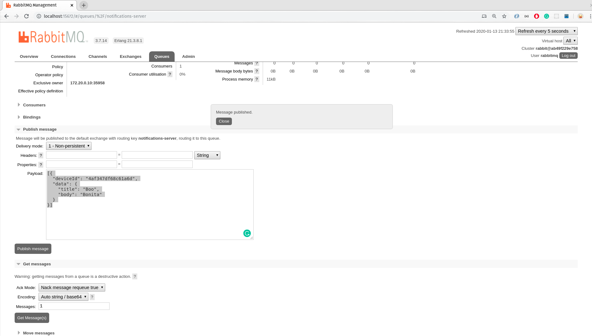

# How to use it?

1. go to http://localhost:15672/#/queues/%2F/services.notifications.server

2. login using the credentials in the docker compose file.

3. Compose a message as shown:
   

## Push Notification

```
[{
  "deviceId": "D1617C36-D805-4FD8-AE6D-EBC57AF5FBCD",
  "data": {
    "title": "Hello",
    "body": "World"
  }
}]
```

## Email

```
[
  {
    "username": "dario",
    "templateId": "d-f6f7173b51044b31a24df0baea670dc4",
    "dynamicTemplateData": {
      "firstName": "Dario",
      "lastName": "Talarico"
    }
  }
]
```

4. In this case, the device with the specified id, `4af347df68c61a6d` has to be previously registered
   and it's token has to be stored in the `devices.push_token` column.
